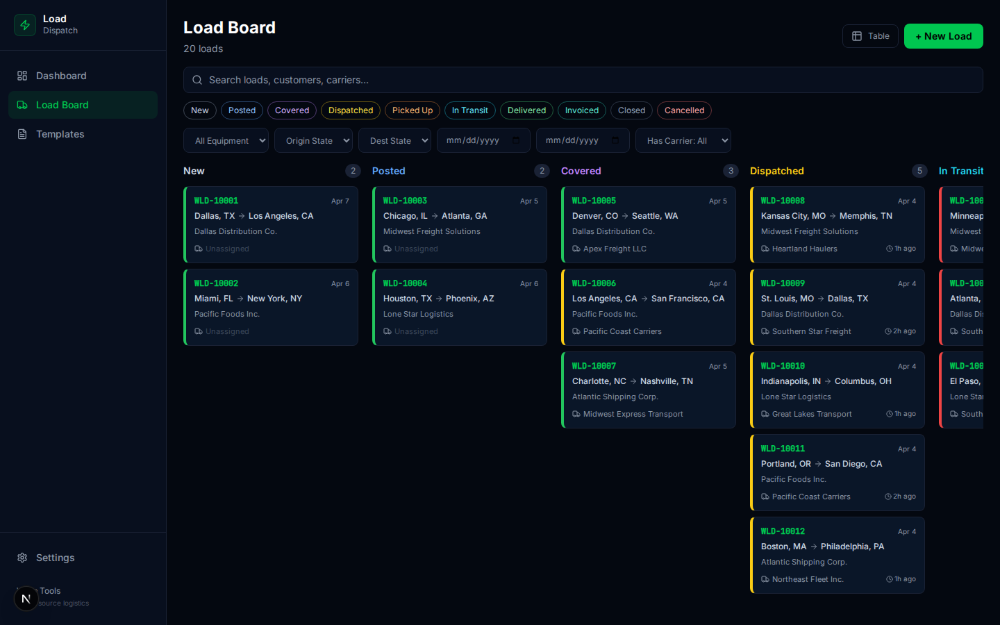
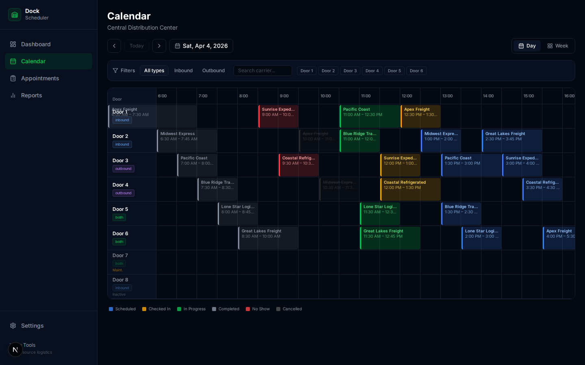

<p align="center">
  <h1 align="center">🚛 Warp Tools</h1>
  <p align="center">
    Free, open-source logistics systems that replace your spreadsheets.
    <br />
    <a href="https://github.com/dasokolovsky/warp-tools/issues">Issues</a>
    ·
    <a href="#systems">Systems</a>
    ·
    <a href="#quick-start">Quick Start</a>
    ·
    <a href="CONTRIBUTING.md">Contributing</a>
  </p>
</p>

<p align="center">
  <a href="https://github.com/dasokolovsky/warp-tools/blob/main/LICENSE"></a>
  <a href="https://github.com/dasokolovsky/warp-tools"></a>
</p>

---

**Not calculators — real software.** Built by [Warp](https://wearewarp.com) because logistics companies shouldn't pay $500/mo for basic operational software.

Every system works standalone with a local SQLite database. No cloud accounts, no subscriptions, no vendor lock-in. Clone it, run it, own your data.


## Systems

| System | What It Replaces | Status |
|--------|-----------------|--------|
| [**Carrier Management**](apps/carrier-management/) | Carrier spreadsheets, expired insurance surprises, guessed performance | ✅ Available |
| [**Invoice & Payment Tracker**](apps/invoice-tracker/) | Excel aging reports, manual follow-up, lost invoices | ✅ Available |
| [**Document Vault**](apps/document-vault/) | Email attachments, shared drives, "where's the POD?" | ✅ Available |
| [**Load Board / Dispatch**](apps/load-dispatch/) | Email chains, WhatsApp groups, phone calls | ✅ Available |
| [**Dock / Appointment Scheduler**](apps/dock-scheduler/) | Phone calls, paper sign-in sheets | ✅ Available |
| [**Driver & Settlement**](apps/driver-settlements/) | Excel pay calculations, disputes | ✅ Available |
| [**Rate Management**](apps/rate-management/) | Emailed rate sheets, manual comparisons | ✅ Available |
| [**Mini TMS**](apps/shipment-management/) | All of the above glued together | ✅ Available |

Each system works standalone. Together they're a platform — systems share carriers, rates, documents, and invoices across a unified schema.

### Micro-Tools

Single-page calculators and generators — no database, no login, just open and use.

| Tool | What It Does |
|------|-------------|
| [**IFTA Calculator**](apps/ifta-calculator/) | Fuel tax reporting across jurisdictions |
| [**Detention Calculator**](apps/detention-calculator/) | Detention/demurrage charge tracking |
| [**Margin Calculator**](apps/margin-calculator/) | Load margin & profitability analysis |
| [**Deadhead Calculator**](apps/deadhead-calculator/) | Empty mile cost estimation |
| [**Rate Con Generator**](apps/rate-con-generator/) | Rate confirmation PDF generation |
| [**Load Profitability**](apps/load-profitability/) | Per-load P&L breakdown |
| [**Settlement Calculator**](apps/settlement-calculator/) | Driver settlement computation |
| [**Freight Parser**](apps/freight-parser/) | Parse freight emails/documents into structured data |

## Quick Start

### Option 1: npm (any system)

```bash
git clone https://github.com/dasokolovsky/warp-tools.git
cd warp-tools
npm install

# Pick any system — they all follow the same pattern:
cd apps/carrier-management   # or any app below
npm run db:migrate           # set up SQLite database (systems only)
npm run db:seed              # optional: load sample data
npm run dev                  # start dev server
```

### Port Reference

| System | Port | Command |
|--------|------|---------|
| Carrier Management | 3001 | `cd apps/carrier-management && npm run dev` |
| Invoice & Payment Tracker | 3003 | `cd apps/invoice-tracker && npm run dev` |
| Document Vault | 3004 | `cd apps/document-vault && npm run dev` |
| Load Board / Dispatch | 3005 | `cd apps/load-dispatch && npm run dev` |
| Dock / Appointment Scheduler | 3006 | `cd apps/dock-scheduler && npm run dev` |
| Driver & Settlement | 3007 | `cd apps/driver-settlements && npm run dev` |
| Rate Management | 3008 | `cd apps/rate-management && npm run dev` |
| Mini TMS (Shipment Management) | 3009 | `cd apps/shipment-management && npm run dev` |
| IFTA Calculator | 3010 | `cd apps/ifta-calculator && npm run dev` |
| Detention Calculator | 3011 | `cd apps/detention-calculator && npm run dev` |
| Margin Calculator | 3012 | `cd apps/margin-calculator && npm run dev` |
| Deadhead Calculator | 3013 | `cd apps/deadhead-calculator && npm run dev` |
| Rate Con Generator | 3014 | `cd apps/rate-con-generator && npm run dev` |
| Load Profitability | 3015 | `cd apps/load-profitability && npm run dev` |
| Settlement Calculator | 3016 | `cd apps/settlement-calculator && npm run dev` |
| Freight Parser | 3017 | `cd apps/freight-parser && npm run dev` |

> **Systems** (carrier-management through shipment-management) require `npm run db:migrate` before first run. **Micro-tools** (calculators) have no database — just `npm run dev`.

### Option 2: Docker

```bash
git clone https://github.com/dasokolovsky/warp-tools.git
cd warp-tools

# Run any system
docker compose up carrier-management    # → http://localhost:3001
docker compose up invoice-tracker       # → http://localhost:3003
docker compose up document-vault        # → http://localhost:3004
docker compose up load-dispatch         # → http://localhost:3005
docker compose up dock-scheduler        # → http://localhost:3006
docker compose up driver-settlements    # → http://localhost:3007
docker compose up rate-management       # → http://localhost:3008
docker compose up shipment-management   # → http://localhost:3009

# Run any calculator (no database needed)
docker compose up ifta-calculator       # → http://localhost:3010
docker compose up detention-calculator  # → http://localhost:3011
docker compose up margin-calculator     # → http://localhost:3012
docker compose up deadhead-calculator   # → http://localhost:3013
docker compose up rate-con-generator    # → http://localhost:3014
docker compose up load-profitability    # → http://localhost:3015
docker compose up settlement-calculator # → http://localhost:3016
docker compose up freight-parser        # → http://localhost:3017

# Or run everything at once
docker compose up -d
```

## Screenshots

### Carrier Management
| Carrier List | Carrier Detail | Compliance Dashboard |
|:---:|:---:|:---:|
|  |  |  |

### Invoice & Payment Tracker
| Invoice Dashboard | Invoice List |
|:---:|:---:|
|  |  |

### Load Dispatch
| Dispatch Dashboard | Load Detail | Kanban Board |
|:---:|:---:|:---:|
|  |  |  |

### Document Vault
| Dashboard | Documents |
|:---:|:---:|
|  |  |

### Dock Scheduler
| Dashboard | Calendar Day View |
|:---:|:---:|
|  |  |

### Driver & Settlement
| Driver Dashboard | Settlement Detail |
|:---:|:---:|
|  |  |

### Rate Management
| Rate Dashboard | Rate Comparison |
|:---:|:---:|
|  |  |

### Mini TMS (Shipment Management)
| TMS Dashboard | Shipment Detail | Kanban Pipeline |
|:---:|:---:|:---:|
|  |  |  |

## Architecture

```
warp-tools/
├── apps/
│   ├── carrier-management/    # Carrier relationship management
│   ├── invoice-tracker/       # Invoice & payment tracking
│   ├── document-vault/        # Freight document management
│   ├── load-dispatch/         # Load board & dispatch
│   ├── dock-scheduler/        # Dock door appointment scheduling
│   ├── driver-settlements/    # Driver pay & settlement management
│   ├── rate-management/       # Lane rates, carrier pricing, RFQs
│   ├── shipment-management/   # Mini TMS — unified shipment lifecycle
│   ├── ifta-calculator/       # IFTA fuel tax calculator
│   ├── detention-calculator/  # Detention & demurrage charges
│   ├── margin-calculator/     # Load margin analysis
│   ├── deadhead-calculator/   # Empty mile cost estimation
│   ├── rate-con-generator/    # Rate confirmation PDF generator
│   ├── load-profitability/    # Per-load P&L breakdown
│   ├── settlement-calculator/ # Driver settlement computation
│   └── freight-parser/        # Parse freight docs to structured data
├── packages/
│   ├── ui/                    # Shared design system (colors, tokens)
│   └── config/                # Shared Tailwind + TypeScript config
├── docker-compose.yml         # One-command self-hosting
├── ARCHITECTURE.md            # Deep dive into system design
└── CONTRIBUTING.md            # How to contribute
```

See [ARCHITECTURE.md](ARCHITECTURE.md) for a deep dive into how the monorepo works, how systems connect, and where to put code.

## Tech Stack

- **[Next.js 16](https://nextjs.org/)** — React framework with App Router and Server Components
- **[Drizzle ORM](https://orm.drizzle.team/)** — Type-safe database access (SQLite for self-hosted, Postgres for hosted)
- **[Tailwind CSS](https://tailwindcss.com/)** — Utility-first styling with custom Warp design tokens
- **[Radix UI](https://www.radix-ui.com/)** — Accessible headless UI components
- **[Turborepo](https://turbo.build/)** — High-performance monorepo build system
- **[Zod](https://zod.dev/)** — Runtime schema validation

## Contributing

We welcome contributions! See the [Contributing Guide](CONTRIBUTING.md) for:

- Development setup
- Branch naming and commit conventions
- PR process
- Architecture overview
- Ideas for what to build next

Each system's README has an **"Ideas & Next Steps"** section with concrete features to build, tagged by difficulty (🟢 Easy, 🟡 Medium, 🔴 Hard).

## Why Open Source?

Logistics runs on spreadsheets, sticky notes, and $500/mo SaaS that looks like it was built in 2008. We think the industry deserves better — and that basic operational software should be free.

Every system is MIT-licensed. Self-host it, modify it, build on it. No telemetry, no data collection, no strings attached.

## License

[MIT](LICENSE) — do whatever you want with it.

---

<p align="center">
  <strong>Built with ❤️ by <a href="https://wearewarp.com">Warp</a></strong> — Modern freight, simplified.
</p>
