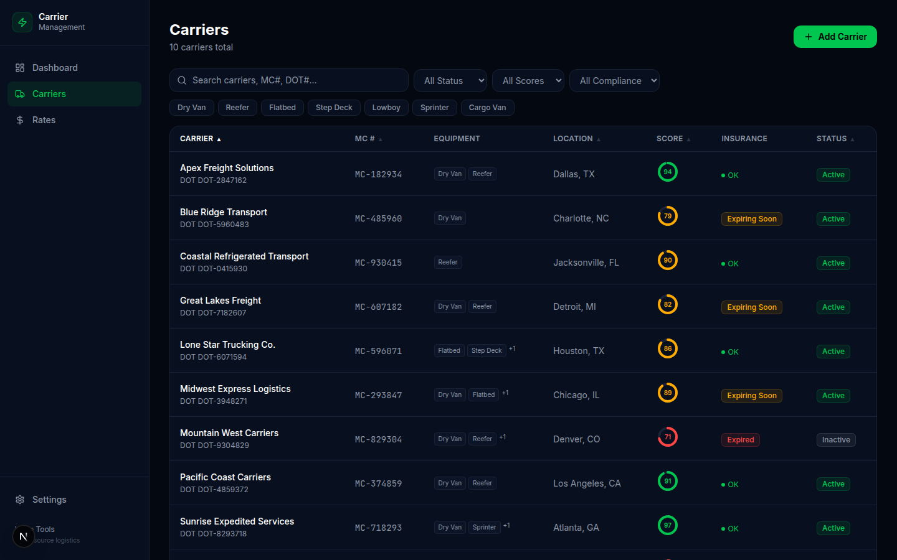
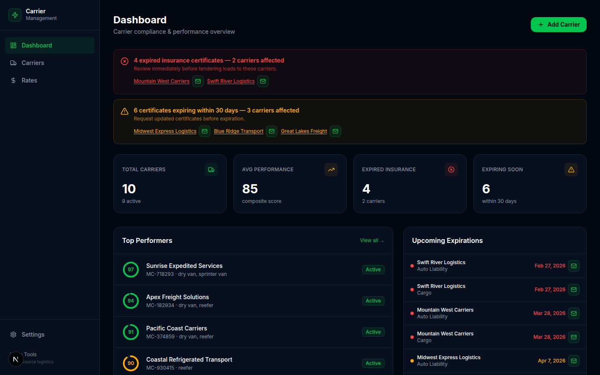
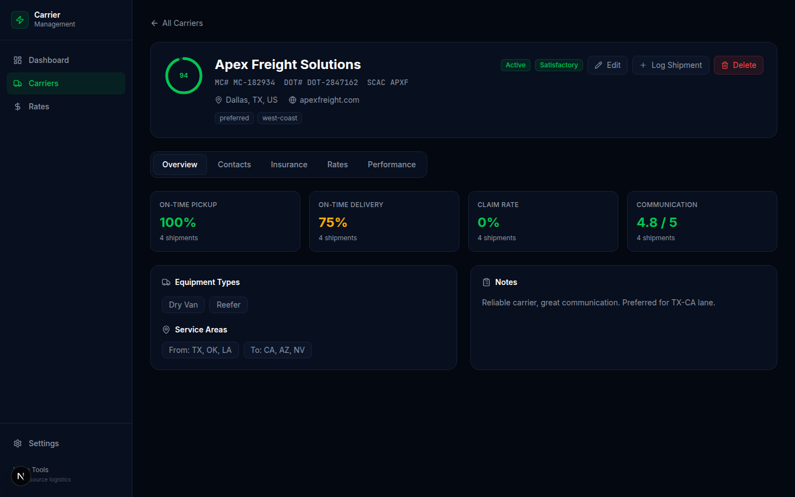
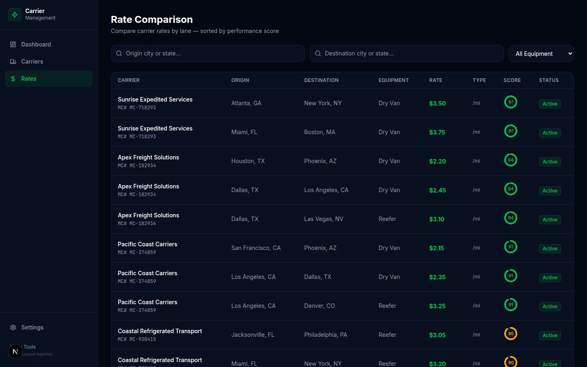
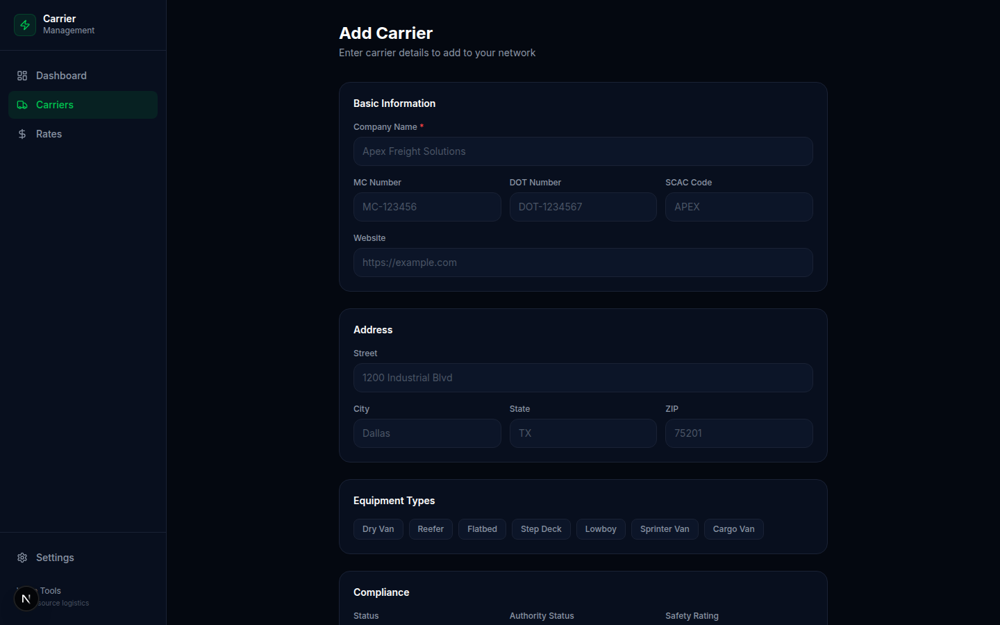
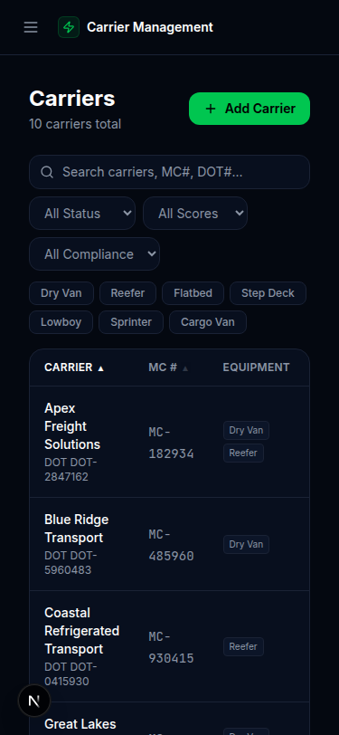

# 🚛 Carrier Management System

> Free, open-source carrier relationship management for freight brokers, shippers, and 3PLs. Track carriers, monitor insurance compliance, score performance, and compare rates — all in one place.



**Replaces:** Your carrier spreadsheet, expired insurance surprises, guessed performance scores, and emailed rate sheets.

## Features

- ✅ **Carrier Database** — Store company info, MC/DOT numbers, equipment types, service areas, contacts
- ✅ **Insurance & Compliance** — Track insurance certificates with expiry alerts (green/yellow/red)
- ✅ **Compliance Dashboard** — See expiring and expired carriers at a glance
- ✅ **Performance Tracking** — Log on-time pickup/delivery, damage claims, communication scores
- ✅ **Performance Scoring** — Weighted composite score with visual indicators
- ✅ **Rate Management** — Store contracted rates per lane with rate type and effective dates
- ✅ **Rate Comparison** — Search carriers by lane and compare rates side-by-side
- ✅ **Advanced Filters** — Filter by status, score range, compliance, equipment type
- ✅ **Sortable Columns** — Click any column header to sort ascending/descending
- ✅ **Pagination** — Handle hundreds of carriers without performance issues
- ✅ **Mobile Responsive** — Usable on phone with card layout and collapsible sidebar
- ✅ **Dark Theme** — Modern dark UI, easy on the eyes
- ✅ **REST API** — Full CRUD API for integrations

## Screenshots

| Dashboard | Carrier Detail | Rate Comparison |
|-----------|---------------|-----------------|
|  |  |  |

| Add Carrier | Mobile View |
|-------------|-------------|
|  |  |

## Quick Start

```bash
# From the monorepo root
git clone https://github.com/dasokolovsky/warp-tools.git
cd warp-tools
npm install

# Set up the database
cd apps/carrier-management
npm run db:migrate
npm run db:seed        # Optional: adds sample carriers for demo

# Start the dev server
npm run dev
# → http://localhost:3001
```

### Or from the monorepo root:

```bash
npm run dev -- --filter=@warp-tools/carrier-management
```

## Project Structure

```
apps/carrier-management/
├── src/
│   ├── app/
│   │   ├── api/carriers/          # REST API routes
│   │   ├── api/dashboard/         # Dashboard data endpoints
│   │   ├── carriers/              # Carrier pages (list, detail, new, edit)
│   │   ├── rates/                 # Rate comparison page
│   │   ├── settings/              # App settings
│   │   ├── layout.tsx             # Root layout with sidebar
│   │   └── page.tsx               # Dashboard (compliance overview)
│   ├── components/                # Shared UI components
│   │   ├── ContactCard.tsx        # Contact display with click-to-call/email
│   │   ├── Pagination.tsx         # Page navigation
│   │   ├── ScoreRing.tsx          # Circular performance score indicator
│   │   ├── Sidebar.tsx            # Navigation sidebar
│   │   ├── SortHeader.tsx         # Sortable table column headers
│   │   ├── StatusBadge.tsx        # Green/yellow/red compliance badges
│   │   └── Toast.tsx              # Success/error notifications
│   ├── db/
│   │   ├── schema.ts              # Drizzle ORM schema (all tables)
│   │   ├── index.ts               # Database connection
│   │   ├── migrate.ts             # Migration runner
│   │   └── seed.ts                # Sample data seeder
│   └── lib/
│       └── utils.ts               # Utility functions
├── drizzle.config.ts              # Drizzle Kit configuration
├── tailwind.config.ts             # Tailwind with Warp design tokens
└── package.json
```

## API Reference

All endpoints accept and return JSON.

### Carriers

| Method | Endpoint | Description |
|--------|----------|-------------|
| `GET` | `/api/carriers` | List carriers (supports `?search=`, `?status=`, `?equipment=`) |
| `POST` | `/api/carriers` | Create a new carrier |
| `GET` | `/api/carriers/:id` | Get carrier details |
| `PATCH` | `/api/carriers/:id` | Update a carrier |
| `DELETE` | `/api/carriers/:id` | Delete a carrier |

### Contacts

| Method | Endpoint | Description |
|--------|----------|-------------|
| `GET` | `/api/carriers/:id/contacts` | List contacts for a carrier |
| `POST` | `/api/carriers/:id/contacts` | Add a contact |
| `PATCH` | `/api/carriers/:id/contacts/:contactId` | Update a contact |
| `DELETE` | `/api/carriers/:id/contacts/:contactId` | Delete a contact |

### Insurance

| Method | Endpoint | Description |
|--------|----------|-------------|
| `GET` | `/api/carriers/:id/insurance` | List insurance records |
| `POST` | `/api/carriers/:id/insurance` | Add insurance record |
| `PATCH` | `/api/carriers/:id/insurance/:insuranceId` | Update insurance record |
| `DELETE` | `/api/carriers/:id/insurance/:insuranceId` | Delete insurance record |

### Rates

| Method | Endpoint | Description |
|--------|----------|-------------|
| `GET` | `/api/carriers/:id/rates` | List rates for a carrier |
| `POST` | `/api/carriers/:id/rates` | Add a rate |
| `PATCH` | `/api/carriers/:id/rates/:rateId` | Update a rate |
| `DELETE` | `/api/carriers/:id/rates/:rateId` | Delete a rate |

### Performance

| Method | Endpoint | Description |
|--------|----------|-------------|
| `POST` | `/api/carriers/:id/performance` | Log a performance record |

### Dashboard

| Method | Endpoint | Description |
|--------|----------|-------------|
| `GET` | `/api/dashboard/compliance` | Compliance summary (expiring, expired counts) |

## Tech Stack

- **Next.js 16** — React framework with App Router
- **Drizzle ORM** — Type-safe database access
- **SQLite** (via `@libsql/client`) — Zero-config database, no server needed
- **Tailwind CSS** — Utility-first styling with Warp design tokens
- **Radix UI** — Accessible headless components
- **Zod** — Schema validation
- **Lucide** — Icon library

## Self-Hosting

This system is designed to run completely standalone with zero external dependencies.

```bash
# Clone and set up
git clone https://github.com/dasokolovsky/warp-tools.git
cd warp-tools
npm install

# Build for production
cd apps/carrier-management
npm run db:migrate
npm run build
npm start
# → Running on http://localhost:3001
```

The database is a local SQLite file (`carrier-management.db`). No Postgres, no cloud services, no accounts needed.

### Docker

```bash
# From the monorepo root
docker compose up carrier-management
# → Running on http://localhost:3001
```

## Data Model

```
carriers ──────────── carrier_contacts (1:many)
    │
    ├──────────────── carrier_insurance (1:many)
    │
    ├──────────────── carrier_rates (1:many)
    │
    └──────────────── carrier_performance (1:many)
```

Each carrier can have multiple contacts, insurance records, contracted rates, and performance logs. Performance scores are calculated as weighted composites of on-time pickup/delivery, damage rates, and communication scores.

## Ideas & Next Steps

Want to contribute? Here are concrete features that would make this system even better:

### 🟢 Easy (Good first issues)

- **Email notifications** — Send alerts when insurance is expiring in 30/14/7 days
- **CSV export** — Export carrier list, rates, or performance data to CSV
- **Webhook events** — Fire webhooks when carriers are added/updated/expire
- **Dark/Light theme toggle** — Currently dark-only; add light theme option
- **Keyboard shortcuts** — `Cmd+K` to search, `N` to add new carrier

### 🟡 Medium

- **Bulk import** — CSV upload to import carrier list from spreadsheet (most users are migrating from Excel)
- **FMCSA API integration** — Auto-lookup carrier info from MC/DOT number via [SAFER Web](https://safer.fmcsa.dot.gov/)
- **Rate trend charts** — Visualize rate changes over time per lane with line/bar charts
- **Saved views** — Save filter combinations as named views ("My Top Carriers", "Expiring This Month")
- **Activity log** — Track who changed what and when (audit trail)
- **Print-friendly views** — Generate printable carrier profiles and rate sheets
- **Multi-select actions** — Select multiple carriers for bulk status change, export, or delete

### 🔴 Hard (High impact)

- **Insurance document OCR** — Upload a certificate image, auto-extract provider, coverage amounts, and dates using AI
- **SAFER API integration** — Pull safety ratings, inspection data, crash history directly from FMCSA
- **Carrier portal** — Generate a unique link for carriers to update their own info, upload insurance docs
- **Multi-tenant** — Support for multiple organizations/teams with role-based access
- **Real-time collaboration** — Multiple users editing simultaneously with conflict resolution
- **Mobile app (PWA)** — Installable progressive web app for field use
- **TMS integration** — Sync carrier data with popular TMS platforms (McLeod, TMW, MercuryGate)

### 🚀 Future Systems Integration

This system is designed to connect with other Warp Tools systems:

- **Invoice Tracker** → Link invoices to carriers, track payment history per carrier
- **Document Vault** → Store BOLs, PODs, and contracts linked to carriers
- **Dispatch** → Assign carriers to loads based on lane rates and performance scores
- **Rate Management** → RFQ workflows, automated rate sheet parsing
- **Mini TMS** → Complete shipment lifecycle with carrier at the center

## Contributing

See the [Contributing Guide](../../CONTRIBUTING.md) for setup instructions, coding standards, and PR process.

## License

MIT — do whatever you want with it.

---

**Part of [Warp Tools](https://github.com/dasokolovsky/warp-tools)** — Free, open-source logistics systems built by [Warp](https://wearewarp.com).
