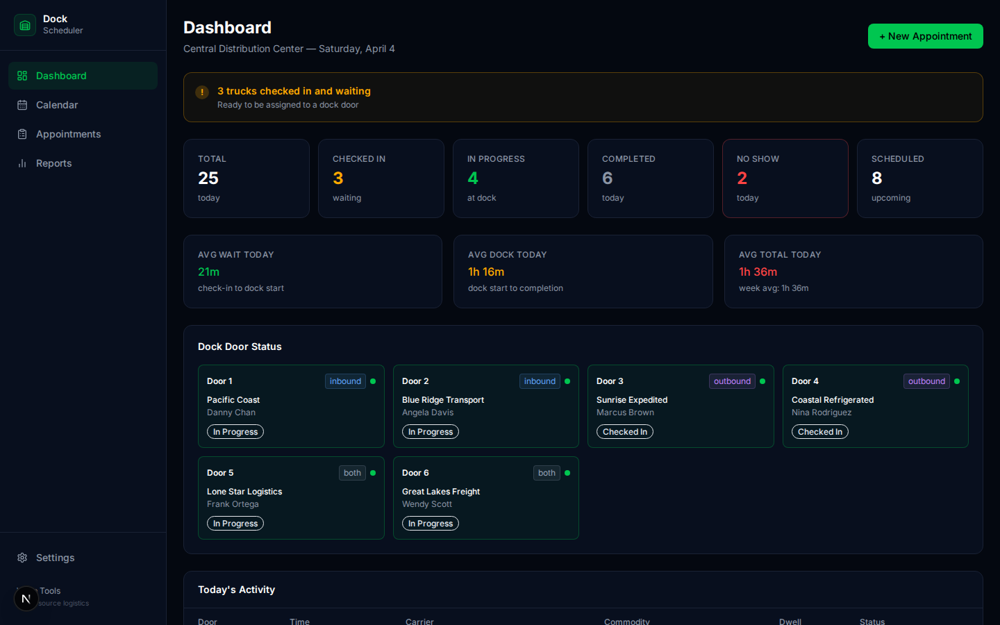
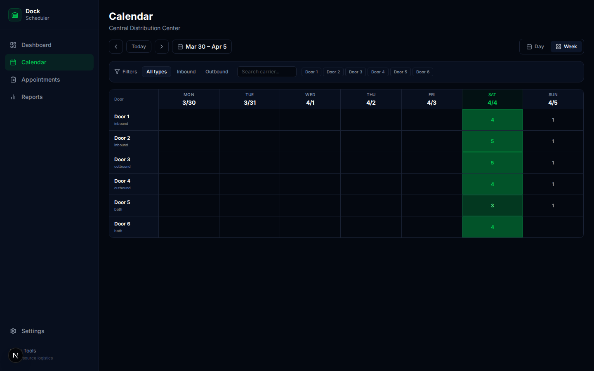
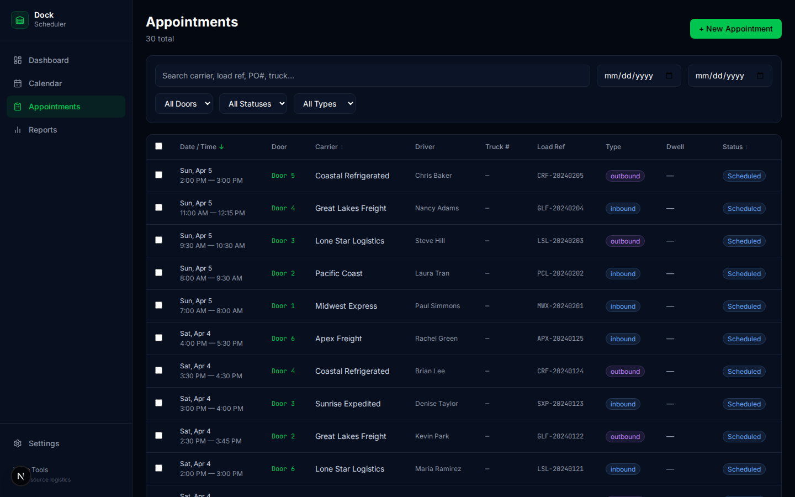
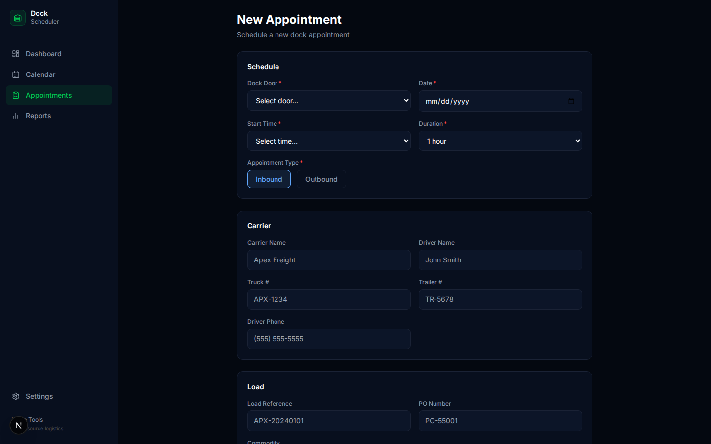
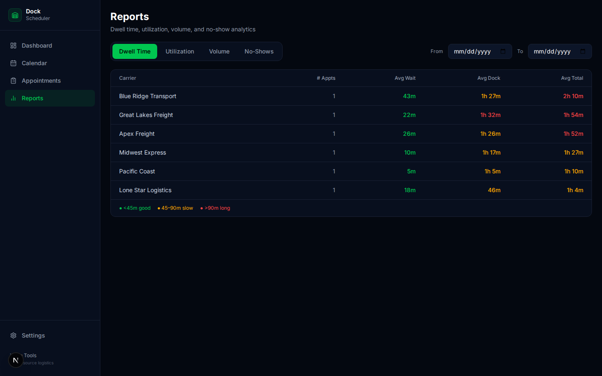
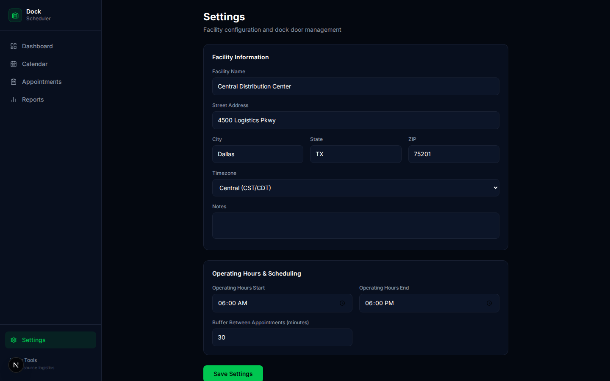
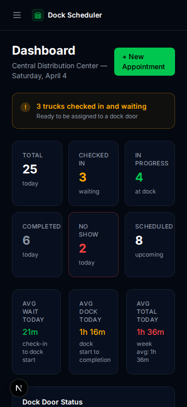

# 🏗️ Dock / Appointment Scheduler
> Free, open-source dock door scheduling for warehouses and DCs. Manage appointments, track dwell times, prevent double-booking — no more whiteboard schedules.

## Features
- ✅ Calendar view (day + week) with CSS Grid — dock doors as rows, time slots as columns
- ✅ Full appointment lifecycle (scheduled → checked_in → in_progress → completed)
- ✅ Conflict detection prevents double-booking
- ✅ Dwell time tracking (wait time, dock time, total dwell)
- ✅ Dashboard with dock status grid, dwell averages, late arrival alerts
- ✅ Reports: dwell time by carrier, utilization, volume, no-show rates
- ✅ Dock door management (add, edit, deactivate, set types)
- ✅ Bulk check-in for dock clerks
- ✅ No-show detection with configurable grace period
- ✅ Dark theme, mobile responsive
- 🔲 Drag-and-drop rescheduling on calendar
- 🔲 Carrier self-service portal
- 🔲 SMS/email appointment confirmations

## Screenshots










## Quick Start
```bash
git clone https://github.com/dasokolovsky/warp-tools
cd warp-tools/apps/dock-scheduler
npm install
npm run db:migrate && npm run db:seed
npm run dev
# → http://localhost:3006
```

## Tech Stack
Next.js 16, Drizzle ORM + SQLite, Tailwind CSS, Lucide Icons, Zod, TypeScript

## API Reference
| Method | Endpoint | Description |
|--------|----------|-------------|
| GET/PATCH | /api/facility | Facility settings |
| GET/POST | /api/dock-doors | Dock door CRUD |
| PATCH/DELETE | /api/dock-doors/:id | Single door |
| GET/POST | /api/appointments | List + Create (with conflict check) |
| GET/PATCH/DELETE | /api/appointments/:id | Single appointment |
| POST | /api/appointments/:id/status | Advance status (check_in/start/complete/no_show/cancel) |
| POST | /api/appointments/bulk-checkin | Bulk check-in |
| GET | /api/calendar?date=&view= | Calendar data |
| GET | /api/dashboard/summary | Dashboard data |
| GET | /api/reports/dwell-time | Dwell time by carrier |
| GET | /api/reports/utilization | Door utilization |
| GET | /api/reports/volume | Appointment volume |
| GET | /api/reports/no-shows | No-show rates |

## Data Model
3 tables: facilities, dock_doors, appointments (31 columns)

## Ideas & Next Steps
### 🟢 Easy
- Add appointment color legend on calendar
- CSV export for appointment list
- Add "Reschedule" button (change time/door)
- Show appointment count per door on settings

### 🟡 Medium
- Drag-and-drop appointment rescheduling on calendar
- SMS appointment reminders (Twilio)
- Carrier self-service booking portal
- Recurring appointment patterns
- Print-friendly daily schedule

### 🔴 Hard
- Integration with Carrier Management (auto-fill carrier data)
- Integration with Load Dispatch (link appointments to loads)
- IoT dock sensor integration (auto check-in/out)
- Multi-facility support
- Yard management (trailer tracking in/out of yard)

## License
MIT
