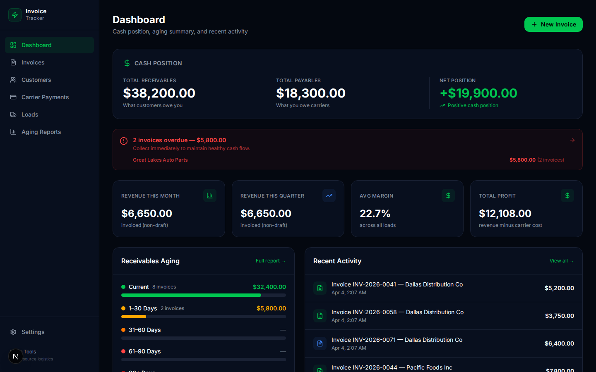
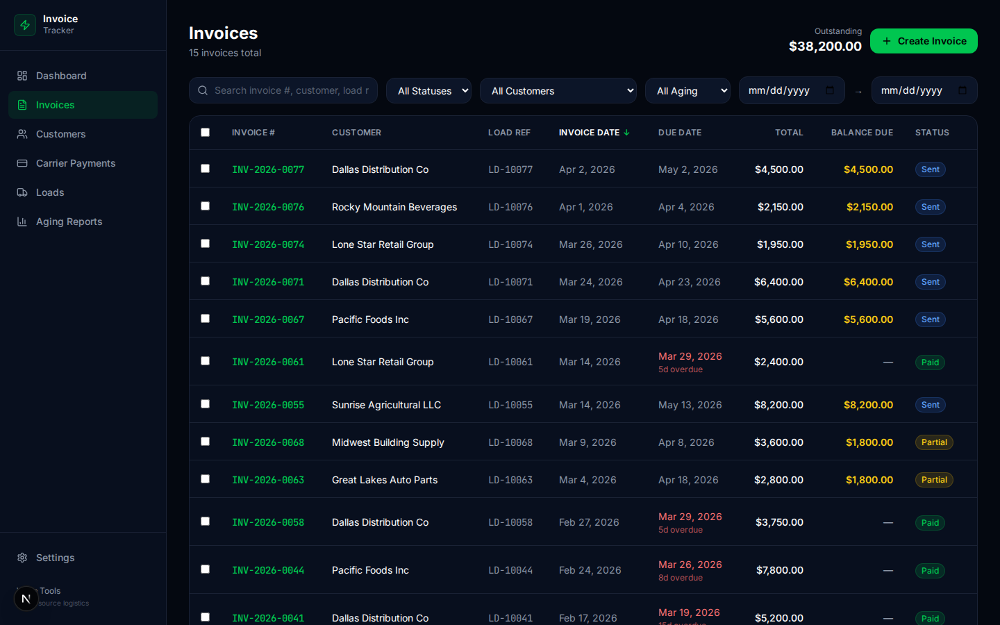
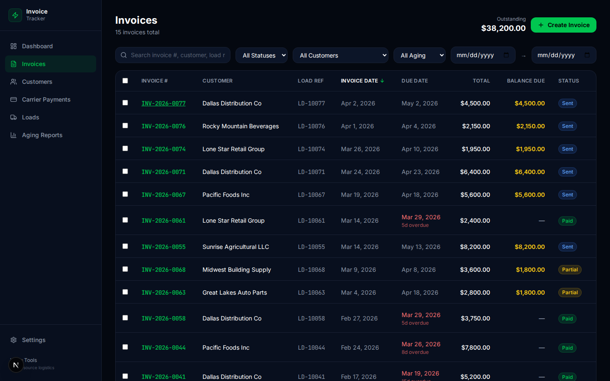
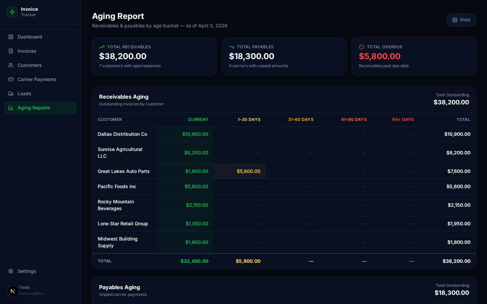
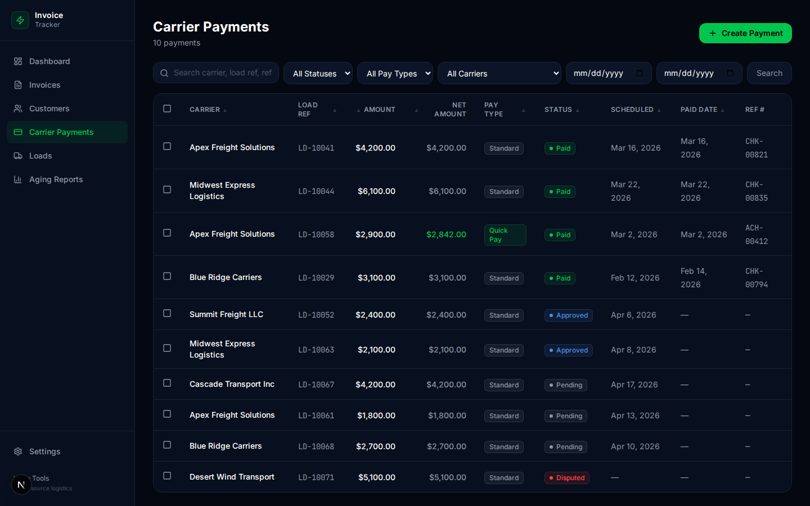
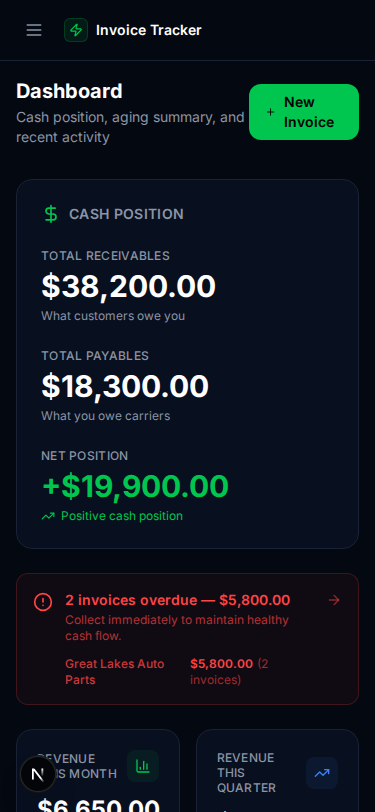

# 💰 Invoice & Payment Tracker

> Free, open-source freight invoice and payment tracking. Track receivables, payables, margins, and aging — no spreadsheets needed.

## Features

- ✅ Two-sided financial tracking (customer invoices + carrier payments)
- ✅ Aging reports (receivables & payables, color-coded, printable)
- ✅ Load profitability ledger with margin tracking
- ✅ Invoice management with line items and payment recording
- ✅ Customer management with payment terms
- ✅ Dashboard with cash position, overdue alerts, revenue metrics
- ✅ Quick-create loads with live margin calculation
- ✅ Bulk actions (mark invoices sent, mark payments paid)
- 🔲 PDF invoice generation
- 🔲 Email integration
- 🔲 Multi-user auth

## Screenshots








## Quick Start

```bash
git clone https://github.com/dasokolovsky/warp-tools
cd warp-tools/apps/invoice-tracker
npm install
npm run db:migrate && npm run db:seed
npm run dev
# → http://localhost:3003
```

## Tech Stack

- **Next.js 16** (App Router, Server Components)
- **Drizzle ORM** + **SQLite** (`@libsql/client`)
- **Tailwind CSS** + **Lucide Icons**
- **Zod** validation
- **TypeScript**

## API Reference

All endpoints return JSON. Base path: `/api`

### Invoices

| Method | Endpoint | Description |
|--------|----------|-------------|
| `GET` | `/api/invoices` | List invoices (filter: status, customerId, search) |
| `POST` | `/api/invoices` | Create invoice |
| `GET` | `/api/invoices/:id` | Get invoice detail with line items + payments |
| `PATCH` | `/api/invoices/:id` | Update invoice |
| `DELETE` | `/api/invoices/:id` | Void/delete invoice |
| `POST` | `/api/invoices/bulk-status` | Bulk update invoice status |
| `GET` | `/api/invoices/:id/line-items` | List line items for an invoice |
| `POST` | `/api/invoices/:id/line-items` | Add a line item |
| `PATCH` | `/api/invoices/:id/line-items/:lineId` | Update a line item |
| `DELETE` | `/api/invoices/:id/line-items/:lineId` | Remove a line item |
| `GET` | `/api/invoices/:id/payments` | List payments received for an invoice |
| `POST` | `/api/invoices/:id/payments` | Record a payment received |
| `DELETE` | `/api/invoices/:id/payments/:paymentId` | Delete a payment record |

### Customers

| Method | Endpoint | Description |
|--------|----------|-------------|
| `GET` | `/api/customers` | List customers (filter: status, search) |
| `POST` | `/api/customers` | Create customer |
| `GET` | `/api/customers/:id` | Get customer detail |
| `PATCH` | `/api/customers/:id` | Update customer |
| `DELETE` | `/api/customers/:id` | Delete customer |

### Carrier Payments

| Method | Endpoint | Description |
|--------|----------|-------------|
| `GET` | `/api/carrier-payments` | List carrier payments (filter: status, carrierId) |
| `POST` | `/api/carrier-payments` | Create carrier payment |
| `GET` | `/api/carrier-payments/:id` | Get carrier payment detail |
| `PATCH` | `/api/carrier-payments/:id` | Update carrier payment |
| `DELETE` | `/api/carrier-payments/:id` | Delete carrier payment |
| `POST` | `/api/carrier-payments/bulk-status` | Bulk update payment status |

### Loads

| Method | Endpoint | Description |
|--------|----------|-------------|
| `GET` | `/api/loads` | List loads with profitability (filter: status, customerId) |
| `POST` | `/api/loads` | Create load |
| `GET` | `/api/loads/:id` | Get load detail |
| `PATCH` | `/api/loads/:id` | Update load |
| `DELETE` | `/api/loads/:id` | Delete load |

### Reports & Dashboard

| Method | Endpoint | Description |
|--------|----------|-------------|
| `GET` | `/api/dashboard/summary` | Cash position, overdue totals, revenue metrics |
| `GET` | `/api/reports/aging` | AR + AP aging buckets (current/30/60/90/90+) |

## Data Model

Six tables, all SQLite via Drizzle ORM:

```
customers
  └─ id (PK), name, billing_contact, email, phone, address
     payment_terms (net_15|net_30|net_45|net_60|quick_pay|factored)
     credit_limit, notes, status (active|inactive|on_hold)

invoices
  └─ id (PK), invoice_number (unique), customer_id → customers
     load_ref, status (draft|sent|partially_paid|paid|overdue|void)
     invoice_date, due_date, subtotal, tax_amount, total, amount_paid, notes

invoice_line_items
  └─ id (PK), invoice_id → invoices (cascade delete)
     description, quantity, unit_price, amount
     line_type (freight|fuel_surcharge|detention|accessorial|lumper|other)

payments_received
  └─ id (PK), invoice_id → invoices (cascade delete)
     amount, payment_date
     payment_method (ach|wire|check|credit_card|factoring|other)
     reference_number, notes

carrier_payments
  └─ id (PK), carrier_id, carrier_name, load_ref
     amount, pay_type (standard|quick_pay|hold)
     quick_pay_discount, net_amount
     status (pending|approved|paid|disputed)
     scheduled_date, paid_date, reference_number, notes

loads
  └─ id (PK), load_ref (unique), customer_id → customers
     carrier_id, carrier_name, revenue, cost
     invoice_id → invoices (nullable), carrier_payment_id → carrier_payments (nullable)
     status (booked|in_transit|delivered|invoiced|paid|cancelled)
     pickup_date, delivery_date, origin, destination, notes
```

**Key relationships:**
- A `load` links one customer invoice and one carrier payment, enabling per-load margin tracking
- `invoice_line_items` and `payments_received` cascade-delete with their parent invoice
- Margin = `loads.revenue - loads.cost` (computed, not stored)

## Ideas & Next Steps

### 🟢 Easy
- Add CSV export for invoice list
- Add "Send Reminder" email template for overdue invoices
- Add invoice number auto-increment from settings
- Dark/light theme toggle

### 🟡 Medium
- PDF invoice generation with company branding
- QuickBooks CSV import/export
- Recurring invoices (monthly retainers)
- Customer payment history charts
- Factoring integration workflow

### 🔴 Hard
- Integration with Carrier Management (pull carrier data directly)
- Multi-currency support
- Automated overdue notifications (cron + email)
- Accounting journal entries (double-entry bookkeeping)

## License

MIT — free to use, modify, and deploy.

---

Built with ❤️ by [Warp](https://wearewarp.com) · [warp-tools on GitHub](https://github.com/dasokolovsky/warp-tools)
