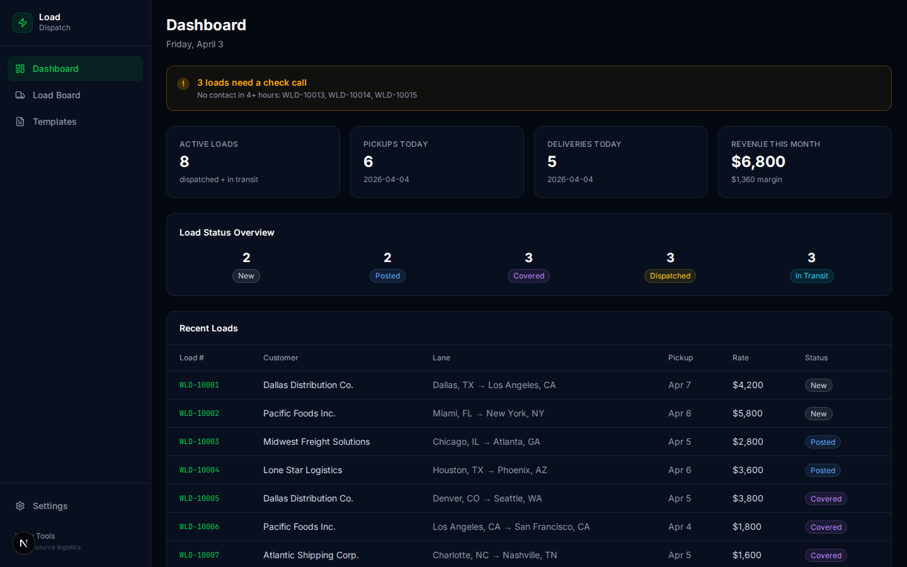
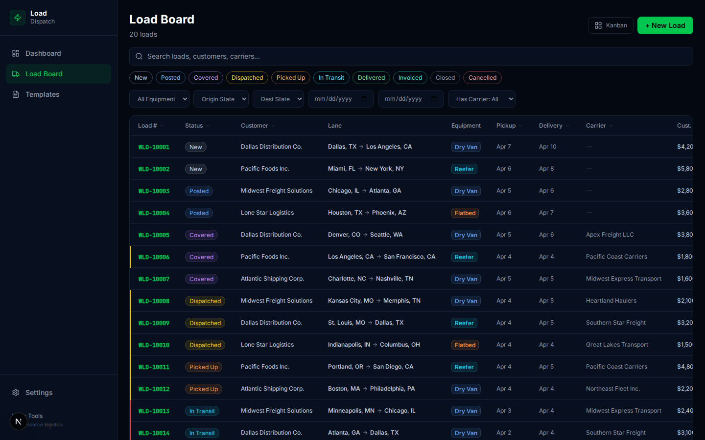
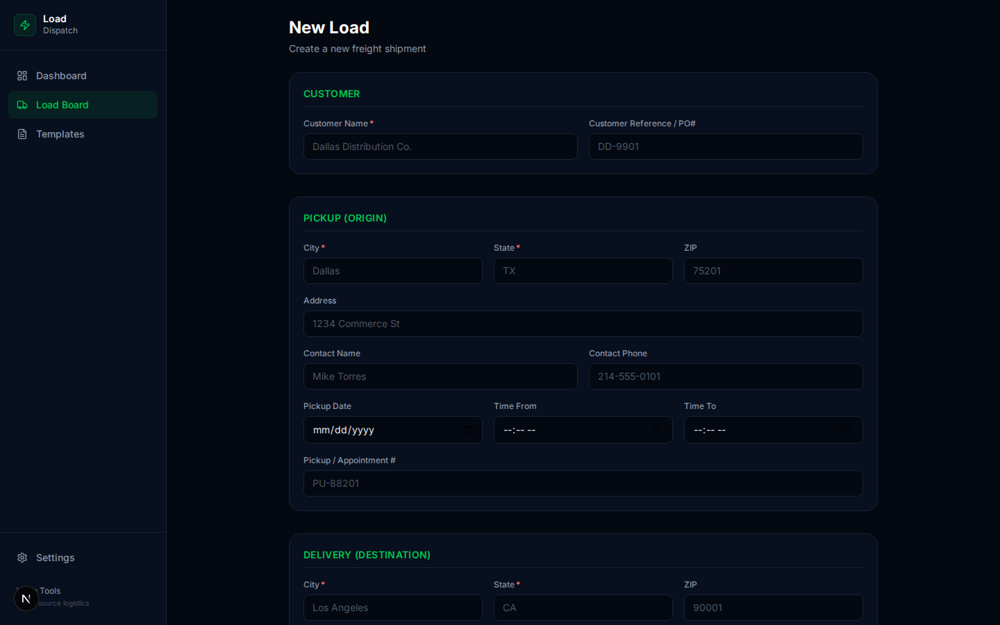
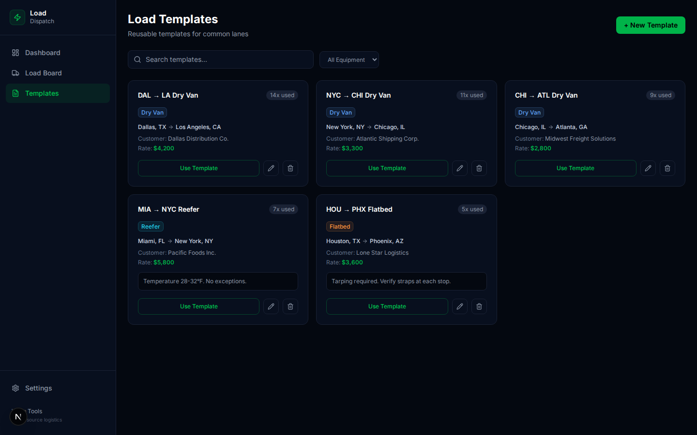
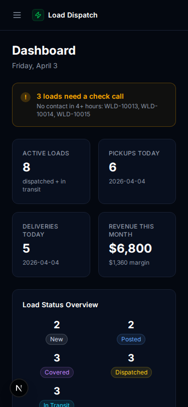

# 🚚 Load Board / Dispatch
> Free, open-source freight dispatch system. Manage the full load lifecycle from booking to delivery — no more WhatsApp dispatching.

## Features
- ✅ Full load lifecycle management (new → posted → covered → dispatched → delivered → closed)
- ✅ Kanban board AND table view toggle
- ✅ Carrier assignment with live margin calculation
- ✅ Check call timeline tracking with overdue alerts
- ✅ Rate confirmation generation (copy/email)
- ✅ Load templates for repeat lanes
- ✅ Dashboard with status summary, today's pickups/deliveries, overdue alerts
- ✅ Urgency color-coding (red=today, yellow=tomorrow, green=later)
- ✅ Advanced search and filters (status, customer, equipment, lane, date range)
- ✅ Load duplication for similar shipments
- ✅ Dark theme, mobile responsive
- 🔲 Drag-and-drop Kanban
- 🔲 Integration with Carrier Management (auto-suggest carriers by lane)
- 🔲 SMS/email check call reminders
- 🔲 Map visualization of active loads

## Screenshots









## Quick Start
```bash
git clone https://github.com/dasokolovsky/warp-tools
cd warp-tools/apps/load-dispatch
npm install
npm run db:migrate && npm run db:seed
npm run dev
# → http://localhost:3005
```

## Tech Stack
Next.js 16, Drizzle ORM + SQLite, Tailwind CSS, Lucide Icons, Zod, TypeScript

## Load Lifecycle
```
new → posted → covered → dispatched → picked_up → in_transit → delivered → invoiced → closed
(any status → cancelled)
```

## API Reference
| Method | Endpoint | Description |
|--------|----------|-------------|
| GET/POST | /api/loads | List (search/filter/sort/pagination) + Create |
| GET/PATCH/DELETE | /api/loads/:id | Load CRUD |
| POST | /api/loads/:id/status | Advance status |
| POST | /api/loads/:id/assign | Assign carrier |
| GET/POST | /api/loads/:id/check-calls | Check call list + create |
| PATCH/DELETE | /api/loads/:id/check-calls/:callId | Edit/delete check call |
| POST | /api/loads/:id/duplicate | Duplicate load |
| GET | /api/loads/:id/rate-con | Generate rate confirmation |
| GET | /api/loads/search | Unified search |
| GET/POST | /api/templates | Template CRUD |
| GET/PATCH/DELETE | /api/templates/:id | Single template |
| POST | /api/templates/:id/use | Create load from template |

## Data Model
3 tables: loads (62 columns), check_calls, load_templates

## Ideas & Next Steps
### 🟢 Easy
- Add load count per customer on dashboard
- Color-code margin on kanban cards
- Add "quick status" buttons on table rows
- Export loads to CSV

### 🟡 Medium
- Drag-and-drop Kanban board
- Map view of active loads (Mapbox/Leaflet)
- SMS check call reminders (Twilio)
- Automated overdue notifications
- Multi-stop loads (pickup at A, deliver to B and C)

### 🔴 Hard
- Integration with Carrier Management (auto-suggest carriers by lane/equipment match)
- Integration with Invoice Tracker (auto-create invoice on "Mark Invoiced")
- Integration with Document Vault (attach BOL/POD to loads)
- Real-time tracking via ELD/GPS integration
- Mobile app for drivers (check call updates)

## License
MIT
