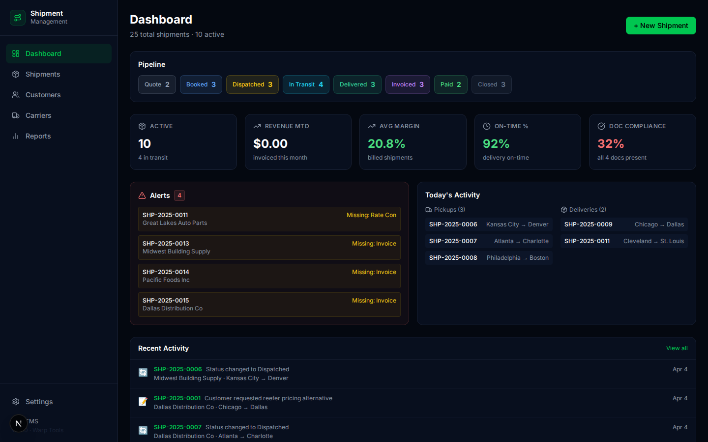
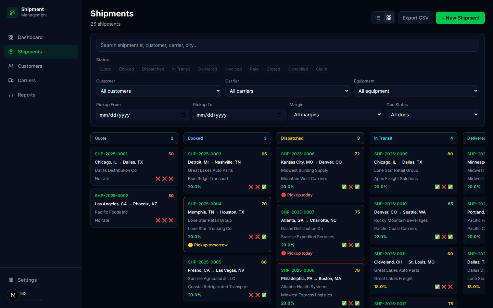
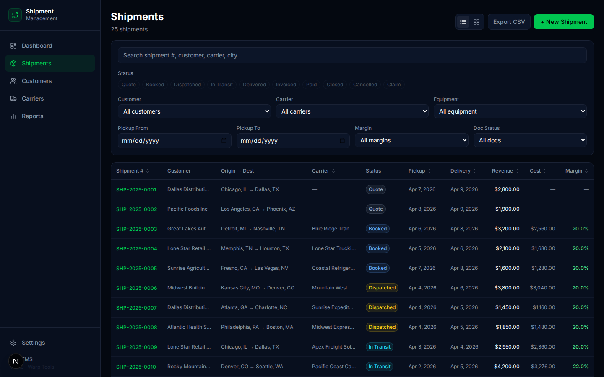
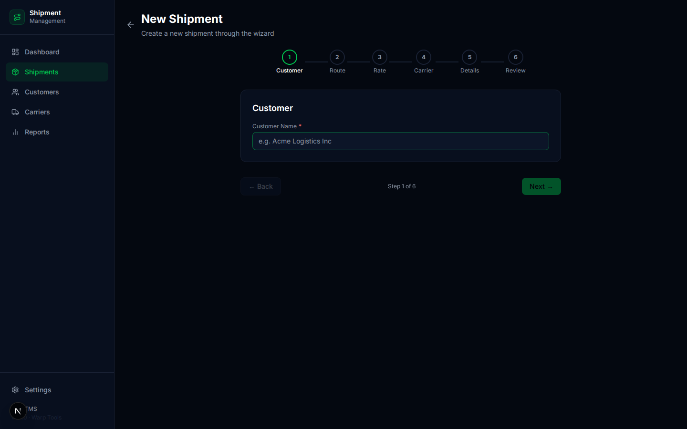
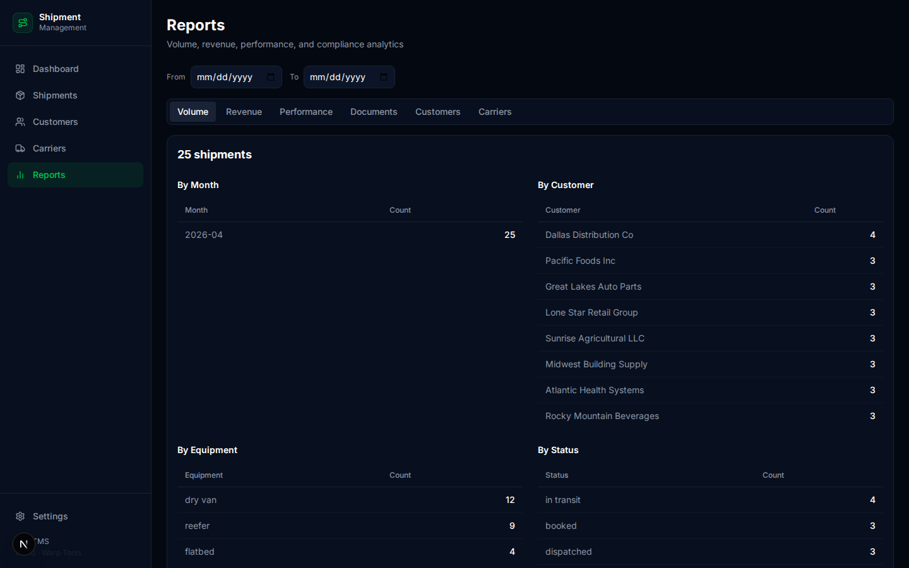
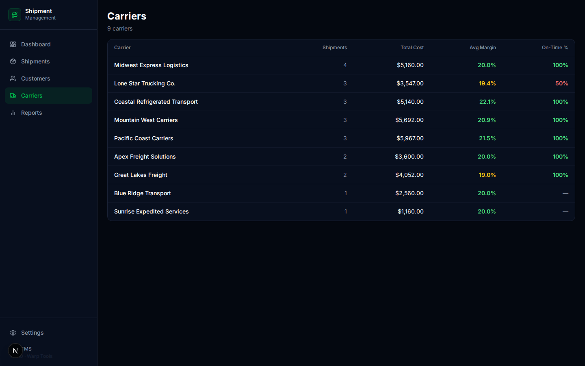
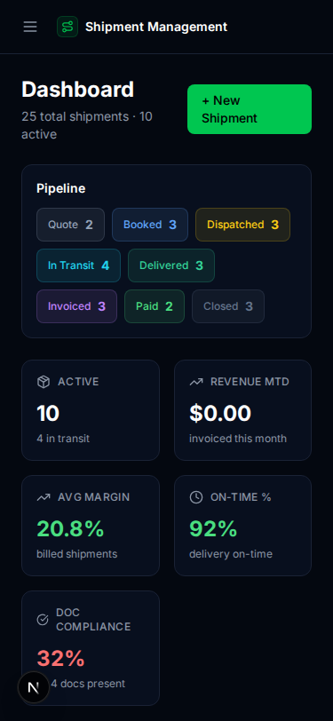

# 🚀 Shipment Management (Mini TMS)
> Free, open-source TMS. The capstone — manages the full shipment lifecycle from quote to close, tying together carriers, invoices, documents, dispatch, and rates.

## Features
- ✅ Full shipment lifecycle (quote → booked → dispatched → in_transit → delivered → invoiced → paid → closed)
- ✅ Shipment creation wizard (6-step guided flow)
- ✅ Shipment edit form (all fields editable)
- ✅ Kanban board + table view
- ✅ Shipment health scores
- ✅ Document completeness tracking (BOL, POD, Rate Con, Invoice)
- ✅ Check call timeline
- ✅ Activity/event log (auto-tracks all changes)
- ✅ Carrier assignment with live margin calculation
- ✅ Dashboard: pipeline, KPIs, alerts, today's activity
- ✅ Reports: volume, revenue/margin, performance, documents, by customer, by carrier
- ✅ CSV export
- ✅ Dark theme, mobile responsive

## Screenshots










## Quick Start
```bash
cd apps/shipment-management && npm install && npm run db:migrate && npm run db:seed && npm run dev
# → http://localhost:3009
```

## Tech Stack
Next.js 16, Drizzle ORM + SQLite, Tailwind CSS, Lucide Icons, Zod, TypeScript

## Data Model
4 tables: shipments (53 columns), shipment_events, shipment_documents, check_calls

## Docker
```bash
docker build -t shipment-management .
docker run -p 3009:3009 -e DATABASE_URL=file:/data/shipments.db -v $(pwd)/data:/data shipment-management
```

## Ideas & Next Steps
### 🟢 Easy
- Add shipment tags and custom fields
- Saved filter views
- Customer-facing tracking portal link

### 🟡 Medium
- Integration with all 7 other core systems (pull live data)
- Multi-stop shipments
- Automated status emails to customers
- Map visualization of active shipments

### 🔴 Hard
- Real-time tracking via ELD/GPS
- AI-powered ETD predictions
- Customer self-service portal
- Mobile app for drivers

## License
MIT
